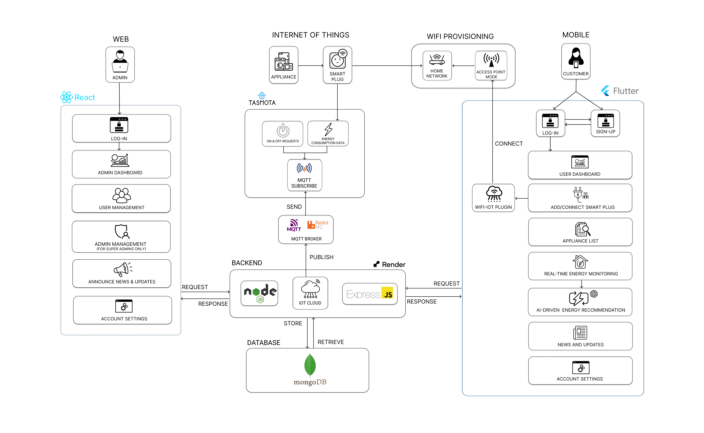

# EcoTrack – Technology Stack Documentation

## Overview  
**EcoTrack** is a **real-time energy monitoring platform** designed to help users optimize electricity consumption using **smart IoT plugs**, a **Flutter-based mobile app**, and **AI-powered energy recommendations** via OpenAI.

It consists of:
- A mobile app for **real-time monitoring and insights**
- A web dashboard for **admin management and news publishing**
- A backend server for **data processing and AI communication**
- An MQTT-based IoT system for **smart plug integration**

---

## System Architecture  

> This architecture shows how **mobile, web, backend, and IoT** components interact through MQTT and REST APIs.

---

## Tech Stack Summary

| **Component**         | **Technology Used**                                     |
|-----------------------|----------------------------------------------------------|
| **Mobile App**        | Flutter (Dart), Riverpod                                 |
| **Admin Dashboard**   | React.js, Redux, Material UI                             |
| **Backend**           | Node.js (Express.js), MongoDB, JWT                       |
| **AI Recommendations**| OpenAI GPT-4 API                                         |
| **IoT Integration**   | Athom Smart Plug v2 (Tasmota), MQTT (RabbitMQ)           |
| **Deployment**        | Render (Backend), Vercel (Frontend), GitHub Actions      |

---

## Mobile Application (User Side)

- **Framework:** Flutter (Dart)  
- **State Management:** Riverpod  
- **Authentication:** Custom JWT  
- **APIs:** RESTful APIs from Express.js  
- **IoT Control:** MQTT over TLS (secured)  

### Features for Customers
-  **User Authentication** (Sign-Up / Login)  
-  **Add & Configure Smart Plugs**  
-  **Appliance List & Control**  
-  **Real-Time Energy Monitoring**  
-  **AI-Driven Energy-Saving Tips**  
-  **News & Maintenance Updates from BATELEC I**  
-  **Profile and Account Settings**

---

## Web Application (Admin Side)

- **Frontend:** React.js with Material UI  
- **State Management:** Redux  
- **Hosted on:** Vercel  
- **APIs:** Same backend as mobile app  

### Features for Admins
-  **User Management** (verify, archive, monitor users)  
-  **Admin Management** (super admin only)  
-  **News & Update Announcements**  
-  **Account Settings**

---

## IoT & Smart Plug Integration

- **Device:** Athom Smart Plug v2 (Tasmota Firmware)  
- **Communication Protocol:** MQTT via RabbitMQ  
- **Data Flow:**  
  1. Smart plug measures energy usage  
  2. Publishes data to MQTT Broker  
  3. Backend subscribes and stores data in MongoDB  
  4. Mobile app fetches live usage data via REST API  

### Security  
- MQTT secured with TLS/SSL  
- User access controlled via JWT

---

## AI-Powered Energy Insights

- **Model:** OpenAI GPT-4 via API  
- **How it works:**
  1. User taps "Get Energy Tip" on the app  
  2. Backend pulls recent plug data from MongoDB  
  3. Formats a structured prompt and sends it to OpenAI  
  4. Receives and returns a customized energy-saving recommendation

- **Use Case:** Suggest off-peak usage, unplug habits, or high-usage alerts

---

## Deployment & DevOps

| **Category**    | **Tech**                                      |
|------------------|-----------------------------------------------|
| **Security**     | JWT Auth, HTTPS, Role-Based Permissions       |
| **Hosting**      | Vercel (Web Frontend), Render (Backend APIs)  |
| **CI/CD**        | GitHub Actions (Auto deploy on push)          |
| **Database**     | MongoDB (hosted)                              |

### Deployment Flow (notes to my devs)
- Push to `main` → GitHub Actions triggers deployment (both FE & BE)
- Frontend built & deployed to Vercel  
- Backend deployed to Render  
- MQTT Broker constantly running to sync plug data  

---

## 👨‍💻 Contributors  
**EcoTrack Backend & Fullstack Team**  
Committed to helping Filipino households monitor and save energy 💡🇵🇭
